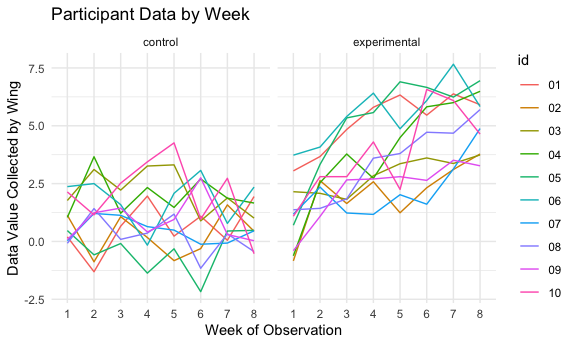

Homework 5
================

**Set up**

## Problem 1

This data was collected from the Washington Post regarding homicides in
50 large US cities. The data details a number of cases and their status,
whether they were closed by arrest, closed with no arrest, or open/no
arrest.

We can read in the data from the Washington Post to learn more.

``` r
homicide_data = 
  read_csv("./homicide-data.csv") %>%
  mutate(
    city_state = str_c(city, state, sep = "_"),
    resolved = case_when(
        disposition == "Closed without arrest" ~ "unsolved",
        disposition == "Open/No arrest"        ~ "unsolved",
        disposition == "Closed by arrest"      ~ "solved",
      
    )
  ) %>%
  select(city_state, resolved) %>%
  filter(city_state != "Tulsa_AL")
```

    ## Rows: 52179 Columns: 12

    ## ── Column specification ────────────────────────────────────────────────────────
    ## Delimiter: ","
    ## chr (9): uid, victim_last, victim_first, victim_race, victim_age, victim_sex...
    ## dbl (3): reported_date, lat, lon

    ## 
    ## ℹ Use `spec()` to retrieve the full column specification for this data.
    ## ℹ Specify the column types or set `show_col_types = FALSE` to quiet this message.

Now we can see how many homicides and how many unsolved homicides are in
each city

``` r
summary_data = 
  homicide_data %>%
  group_by(city_state) %>%
  summarize(
    hom_total = n(),
    hom_unsolved = sum(resolved == "unsolved")
  )
  
view(summary_data)
```

There are 50 cities in this data set. But let’s focus on our Baltimore
data!

``` r
baltimore_prop_test =
  prop.test(
  summary_data %>%
    filter(city_state == "Baltimore_MD") %>%
    pull(hom_unsolved),
    summary_data %>%
      filter(city_state == "Baltimore_MD") %>%
        pull(hom_total))


baltimore_prop_test %>%
  broom::tidy() %>%
  knitr::kable()
```

|  estimate | statistic | p.value | parameter |  conf.low | conf.high | method                                               | alternative |
|----------:|----------:|--------:|----------:|----------:|----------:|:-----------------------------------------------------|:------------|
| 0.6455607 |   239.011 |       0 |         1 | 0.6275625 | 0.6631599 | 1-sample proportions test with continuity correction | two.sided   |

For Baltimore, Maryland, the estimated proportion of homicides that are
unsolved is 0.646. The confidence interval around this is (0.628,
0.663), meaning that we are 95% sure that the true proportion of
homicides that are unsolved is between 0.628 and 0.663.

We can now do the same analysis for all of the cities in our data frame:

``` r
prop_test_cities = 
  function(homicide_data){
    cities = 
      homicide_data %>%
      summarize(
        unsolved = sum(resolved == "unsolved"),
        count = n()
      )
    
    cities_test = 
      prop.test(
        x = cities %>%
          pull(unsolved),
        n = cities %>%
          pull(count)
      )
    
    
    return(cities_test)
    
  }

cities_test_results = 
  homicide_data %>%
    nest(data = resolved) %>%
    mutate(
      test_results = map(data, prop_test_cities),
      tidy_output = map(test_results, broom::tidy)
    ) %>%
  select(city_state, tidy_output) %>%
  unnest(tidy_output) %>%
  select(city_state, estimate, starts_with("conf"))

head(cities_test_results) %>%
  knitr::kable()
```

| city\_state     |  estimate |  conf.low | conf.high |
|:----------------|----------:|----------:|----------:|
| Albuquerque\_NM | 0.3862434 | 0.3372604 | 0.4375766 |
| Atlanta\_GA     | 0.3833505 | 0.3528119 | 0.4148219 |
| Baltimore\_MD   | 0.6455607 | 0.6275625 | 0.6631599 |
| Baton Rouge\_LA | 0.4622642 | 0.4141987 | 0.5110240 |
| Birmingham\_AL  | 0.4337500 | 0.3991889 | 0.4689557 |
| Boston\_MA      | 0.5048860 | 0.4646219 | 0.5450881 |

Now that we have all of our estimates, we can create a plot with error
bars that shows the distribution of proportion of unsolved homicides in
order from least to most.

``` r
cities_test_results %>%
  mutate(city_state = fct_reorder(city_state, estimate)) %>%
  ggplot(aes(x = city_state, y = estimate)) + geom_point() + geom_errorbar(
    aes(ymin = conf.low, ymax = conf.high)) + theme(axis.text.x = element_text(
      angle = 90, vjust = 0.5, hjust = 1))
```


We can see from this output that Richmond, VA has the lowest proportion
of unsolved homicides and Chicago, IL has the highest.

## Problem 2

We have been presented with a zip file full of longitudinal study data.
We can read in and tidy this data so that it is more easily understood
and better for graphical visualization.

``` r
longitudinal_study =
  tibble(file_name = list.files(path = "./data", full.names = TRUE)) %>%
  mutate(data = purrr::map(.x = file_name, ~read_csv(.x))) %>%
  unnest(data) %>%
    separate(file_name, c("file_1", "file_2", "name"), sep = "/") %>%
    separate(name, c("arm", "id", "csv")) %>%
      mutate(wing = recode(arm, con = "control", exp = "experimental")) %>%
  select(-file_1, -file_2, -csv, -arm) %>%
  pivot_longer(week_1:week_8,
               names_to = "week",
               values_to = "data_point",
               names_prefix = "week_"
               ) %>%
  mutate(as.factor(week))
```

    ## Rows: 1 Columns: 8

    ## ── Column specification ────────────────────────────────────────────────────────
    ## Delimiter: ","
    ## dbl (8): week_1, week_2, week_3, week_4, week_5, week_6, week_7, week_8

    ## 
    ## ℹ Use `spec()` to retrieve the full column specification for this data.
    ## ℹ Specify the column types or set `show_col_types = FALSE` to quiet this message.

    ## Rows: 1 Columns: 8

    ## ── Column specification ────────────────────────────────────────────────────────
    ## Delimiter: ","
    ## dbl (8): week_1, week_2, week_3, week_4, week_5, week_6, week_7, week_8

    ## 
    ## ℹ Use `spec()` to retrieve the full column specification for this data.
    ## ℹ Specify the column types or set `show_col_types = FALSE` to quiet this message.

    ## Rows: 1 Columns: 8

    ## ── Column specification ────────────────────────────────────────────────────────
    ## Delimiter: ","
    ## dbl (8): week_1, week_2, week_3, week_4, week_5, week_6, week_7, week_8

    ## 
    ## ℹ Use `spec()` to retrieve the full column specification for this data.
    ## ℹ Specify the column types or set `show_col_types = FALSE` to quiet this message.

    ## Rows: 1 Columns: 8

    ## ── Column specification ────────────────────────────────────────────────────────
    ## Delimiter: ","
    ## dbl (8): week_1, week_2, week_3, week_4, week_5, week_6, week_7, week_8

    ## 
    ## ℹ Use `spec()` to retrieve the full column specification for this data.
    ## ℹ Specify the column types or set `show_col_types = FALSE` to quiet this message.

    ## Rows: 1 Columns: 8

    ## ── Column specification ────────────────────────────────────────────────────────
    ## Delimiter: ","
    ## dbl (8): week_1, week_2, week_3, week_4, week_5, week_6, week_7, week_8

    ## 
    ## ℹ Use `spec()` to retrieve the full column specification for this data.
    ## ℹ Specify the column types or set `show_col_types = FALSE` to quiet this message.

    ## Rows: 1 Columns: 8

    ## ── Column specification ────────────────────────────────────────────────────────
    ## Delimiter: ","
    ## dbl (8): week_1, week_2, week_3, week_4, week_5, week_6, week_7, week_8

    ## 
    ## ℹ Use `spec()` to retrieve the full column specification for this data.
    ## ℹ Specify the column types or set `show_col_types = FALSE` to quiet this message.

    ## Rows: 1 Columns: 8

    ## ── Column specification ────────────────────────────────────────────────────────
    ## Delimiter: ","
    ## dbl (8): week_1, week_2, week_3, week_4, week_5, week_6, week_7, week_8

    ## 
    ## ℹ Use `spec()` to retrieve the full column specification for this data.
    ## ℹ Specify the column types or set `show_col_types = FALSE` to quiet this message.

    ## Rows: 1 Columns: 8

    ## ── Column specification ────────────────────────────────────────────────────────
    ## Delimiter: ","
    ## dbl (8): week_1, week_2, week_3, week_4, week_5, week_6, week_7, week_8

    ## 
    ## ℹ Use `spec()` to retrieve the full column specification for this data.
    ## ℹ Specify the column types or set `show_col_types = FALSE` to quiet this message.

    ## Rows: 1 Columns: 8

    ## ── Column specification ────────────────────────────────────────────────────────
    ## Delimiter: ","
    ## dbl (8): week_1, week_2, week_3, week_4, week_5, week_6, week_7, week_8

    ## 
    ## ℹ Use `spec()` to retrieve the full column specification for this data.
    ## ℹ Specify the column types or set `show_col_types = FALSE` to quiet this message.

    ## Rows: 1 Columns: 8

    ## ── Column specification ────────────────────────────────────────────────────────
    ## Delimiter: ","
    ## dbl (8): week_1, week_2, week_3, week_4, week_5, week_6, week_7, week_8

    ## 
    ## ℹ Use `spec()` to retrieve the full column specification for this data.
    ## ℹ Specify the column types or set `show_col_types = FALSE` to quiet this message.

    ## Rows: 1 Columns: 8

    ## ── Column specification ────────────────────────────────────────────────────────
    ## Delimiter: ","
    ## dbl (8): week_1, week_2, week_3, week_4, week_5, week_6, week_7, week_8

    ## 
    ## ℹ Use `spec()` to retrieve the full column specification for this data.
    ## ℹ Specify the column types or set `show_col_types = FALSE` to quiet this message.

    ## Rows: 1 Columns: 8

    ## ── Column specification ────────────────────────────────────────────────────────
    ## Delimiter: ","
    ## dbl (8): week_1, week_2, week_3, week_4, week_5, week_6, week_7, week_8

    ## 
    ## ℹ Use `spec()` to retrieve the full column specification for this data.
    ## ℹ Specify the column types or set `show_col_types = FALSE` to quiet this message.

    ## Rows: 1 Columns: 8

    ## ── Column specification ────────────────────────────────────────────────────────
    ## Delimiter: ","
    ## dbl (8): week_1, week_2, week_3, week_4, week_5, week_6, week_7, week_8

    ## 
    ## ℹ Use `spec()` to retrieve the full column specification for this data.
    ## ℹ Specify the column types or set `show_col_types = FALSE` to quiet this message.

    ## Rows: 1 Columns: 8

    ## ── Column specification ────────────────────────────────────────────────────────
    ## Delimiter: ","
    ## dbl (8): week_1, week_2, week_3, week_4, week_5, week_6, week_7, week_8

    ## 
    ## ℹ Use `spec()` to retrieve the full column specification for this data.
    ## ℹ Specify the column types or set `show_col_types = FALSE` to quiet this message.

    ## Rows: 1 Columns: 8

    ## ── Column specification ────────────────────────────────────────────────────────
    ## Delimiter: ","
    ## dbl (8): week_1, week_2, week_3, week_4, week_5, week_6, week_7, week_8

    ## 
    ## ℹ Use `spec()` to retrieve the full column specification for this data.
    ## ℹ Specify the column types or set `show_col_types = FALSE` to quiet this message.

    ## Rows: 1 Columns: 8

    ## ── Column specification ────────────────────────────────────────────────────────
    ## Delimiter: ","
    ## dbl (8): week_1, week_2, week_3, week_4, week_5, week_6, week_7, week_8

    ## 
    ## ℹ Use `spec()` to retrieve the full column specification for this data.
    ## ℹ Specify the column types or set `show_col_types = FALSE` to quiet this message.

    ## Rows: 1 Columns: 8

    ## ── Column specification ────────────────────────────────────────────────────────
    ## Delimiter: ","
    ## dbl (8): week_1, week_2, week_3, week_4, week_5, week_6, week_7, week_8

    ## 
    ## ℹ Use `spec()` to retrieve the full column specification for this data.
    ## ℹ Specify the column types or set `show_col_types = FALSE` to quiet this message.

    ## Rows: 1 Columns: 8

    ## ── Column specification ────────────────────────────────────────────────────────
    ## Delimiter: ","
    ## dbl (8): week_1, week_2, week_3, week_4, week_5, week_6, week_7, week_8

    ## 
    ## ℹ Use `spec()` to retrieve the full column specification for this data.
    ## ℹ Specify the column types or set `show_col_types = FALSE` to quiet this message.

    ## Rows: 1 Columns: 8

    ## ── Column specification ────────────────────────────────────────────────────────
    ## Delimiter: ","
    ## dbl (8): week_1, week_2, week_3, week_4, week_5, week_6, week_7, week_8

    ## 
    ## ℹ Use `spec()` to retrieve the full column specification for this data.
    ## ℹ Specify the column types or set `show_col_types = FALSE` to quiet this message.

    ## Rows: 1 Columns: 8

    ## ── Column specification ────────────────────────────────────────────────────────
    ## Delimiter: ","
    ## dbl (8): week_1, week_2, week_3, week_4, week_5, week_6, week_7, week_8

    ## 
    ## ℹ Use `spec()` to retrieve the full column specification for this data.
    ## ℹ Specify the column types or set `show_col_types = FALSE` to quiet this message.

Now we can use the resulting dataframe, *longitudinal\_study*, to create
a spaghetti plot so we can better understand the trends.

``` r
longitudinal_study %>%
  ggplot(aes(x = week, y = data_point, group = id, color = id)) + geom_line() +
  theme(legend.position = "right") +
  labs(
    x = "Week of Observation",
    y = "Data Value Collected by Wing",
    title = "Participant Data by Week"
  ) + facet_grid(cols = vars(wing))
```



From this graph, it is easy to see that the values in the experimental
group are much higher than the control group, and the upward trend in
points among the experimental group are much more consistent. It almost
appears that the majority of the control group trend downwards as the
weeks go on, whereas the experimental group almost all grow up.

## Question 3

For this homework, we were provided with a code chunk that will load the
iris data set, which we can read in now.

``` r
library(tidyverse)

set.seed(10)

iris_with_missing = iris %>% 
  map_df(~replace(.x, sample(1:150, 20), NA)) %>%
  mutate(Species = as.character(Species)) %>%
  janitor::clean_names()

view(iris_with_missing)
```

This data has 150 rows and 5 columns. However, there are a number of
missing values:

``` r
colSums(is.na(iris_with_missing))
```

    ## sepal_length  sepal_width petal_length  petal_width      species 
    ##           20           20           20           20           20

We can see from the data frame that there are 20 missing observations in
each column. We can substitute the appropriate fill-ins and clean using
the code chunk below.

``` r
cleaning_function = function(x){
  if (is.character(x)) {
    x = replace_na(x, "virginica")
  } else if (is.numeric(x)) {
    x = replace_na(x, mean(x, na.rm = TRUE))
  }
}
  
cleaning_iris = 
  map(iris_with_missing, cleaning_function) %>%
  as_tibble()

colSums(is.na(cleaning_iris))
```

    ## sepal_length  sepal_width petal_length  petal_width      species 
    ##            0            0            0            0            0

We can see now that there are no missing values in ANY column, and our
data is now cleaned!
